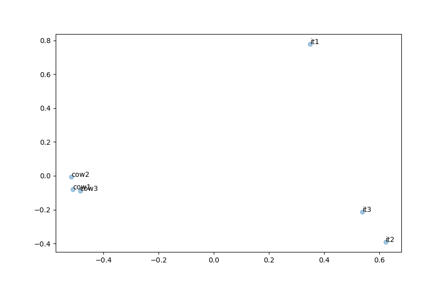

# neural_note_linking
Categorize bits of text by how similar they are using neural language models

# Usage example

```python
texts = [
    "I am a cow.",
    "My nature is that of a bovine.",
    "Je suis un animal qui donne du lait à ses veaux.",
    "Microprocessors are this company's specialty.",
    "Recent advances in quantum computing have been promising.",
    "La puissance des ordinateurs double tous les trois ans."
]

names = [
    "cow1",
    "cow2",
    "cow3",
    "it1",
    "it2",
    "it3"
]

dist = get_text_distances(texts, names)
print(dist.sort_values())
```

```
cow1  cow3    0.170995
      cow2    0.180422
cow2  cow3    0.196127
it2   it3     0.353634
it1   it3     0.411704
      it2     0.425816
cow2  it1     0.437633
cow3  it1     0.452270
cow1  it1     0.453539
cow3  it3     0.472382
cow2  it3     0.480014
cow1  it2     0.492905
      it3     0.494314
cow3  it2     0.496226
cow2  it2     0.516734
```

The algorithm correctly sorts the texts by similarity, grouping all 3 texts about cows together and
all 3 about IT together; and it does that across 2 different languages!

We can also generate a plot for the notes using the embeddings provided by the transformer.

```python
embed_and_plot(texts, names, sentence_transformer)
```



In this space, euclidean distance between the represented texts can be interpreted as semantic distance.
